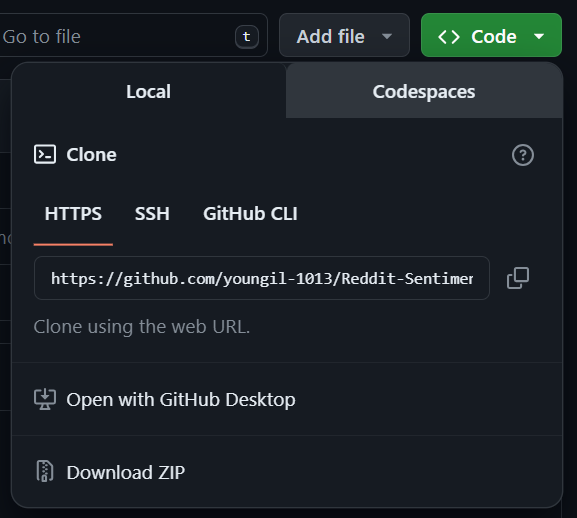
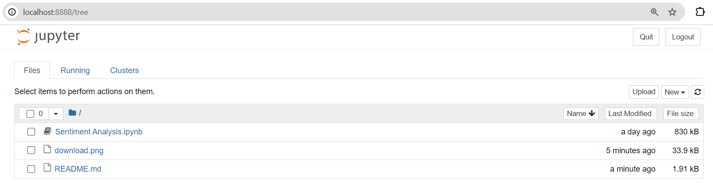

# Reddit Sentiment Analysis

The following Jupyter Notebook runs a sentiment analysis on a given subreddit. For the purposes of the template, the analysis is run on [r/CryptoCurrency](https://www.reddit.com/r/CryptoCurrency/), but one may changed the target subreddit as desired.

Read more about this mini project at my [Blog](https://youngil-1013.github.io/blog.html)

## 1. Prerequisites:
1. **Recent stable version of Python**. The code shown here was written in Python 3.10.11, but most non-depricated versions should work. [Download Python here](https://www.python.org/downloads/)
2. **Jupyter Notebook**. Jupyter notebook. Jupyter notebook allows comments and code on the same file and works amazingly with Python. [Download Jupyter Notebook here](https://jupyter.org/install)
3. **All necessary Python packages**. Once you begin to run the code on Jupyter notebook, some lines will complain:
    ```python 
        ImportError: No module named *package_name*
    ```
    If so, create a new line, and type the following, obviously replacing the *package_name* with the required package name:
    ```python 
        pip install *package_name*
    ```
4. **Sign up and request a Reddit API**
Along the way, you will need to use Reddit's API. You must request it and use the information in the Jupyter notebook. [Request Reddit API here](https://www.reddit.com/wiki/api/).

## 2. Running the project:
If you are familiar with git, you may clone this project into your local directory. If not, you can press on the 
 Green **<> Code** button on press **Download ZIP**.

Then, you will have to locate the file using your terminal. Usually, it should be located in the Downloads folder under C: Drive, but if you have moved in somewhere else, you will need to know the path to it. Once you are at the root of the folder, type "Jupyter notebook". Then, a Jupyter instance will start on your web browswer:


Then, just click on the SentimentAnalysis.ipynb and follow the instructions!

## 3. Next Steps:
This project was a revisit to a project I did over 2 years ago. PRAW, the Reddit API Package wrapper I use for this project does not include time data, but [PSAW](https://pushshift.io/signup) allows time-annotated data. Maybe I can do a time-series study of Bitcoin sentiment.